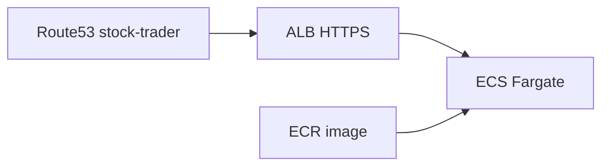

# Deploy `https://stock-trader.abhinavsarja.com` on AWS

This doc describes how to put the Chainlit app (`app.py`) on **`stock-trader.abhinavsarja.com`** using AWS, **without** running it in Amplify Hosting (Amplify stays for your static site).

## End state

- **HTTPS** at `https://stock-trader.abhinavsarja.com`
- **Chainlit** at path `/` on that host (no `--root-path` needed for a dedicated subdomain)
- **Secrets** only in AWS (env / Secrets Manager), not in Git

## AWS App Runner (legacy for new deployments)

**Starting April 30, 2026, AWS App Runner no longer accepts new customers.** Existing App Runner services keep running. If you cannot create a new App Runner service, use **ECS Express Mode**, **ECS Fargate + ALB** (manual), or **Elastic Beanstalk** (Docker platform).

## Why not Amplify for Chainlit?

**Amplify Hosting** targets static sites / supported SSR stacks. Chainlit is a **long-running Python** app with **WebSockets**. Run it on **ECS Express Mode**, **ECS Fargate + ALB**, **Elastic Beanstalk**, or **EC2**.

## Recommended path (new deployments): ECS Fargate + ALB + ECR + Route 53



### Fastest setup: Amazon ECS Express Mode

**You can use ECS Express Mode** for this app. It is **not** excluded—it provisions **Fargate**, an **Application Load Balancer**, **HTTPS + ACM**, and scaling defaults from your **ECR** image with far fewer clicks than wiring ECS + ALB manually. Official overview: [Amazon ECS Express Mode](https://docs.aws.amazon.com/AmazonECS/latest/developerguide/express-service-overview.html).

**Match this repo’s container:**

- Set **container port `8080`** (Express defaults often assume **80**; our [Dockerfile](../Dockerfile) uses **`PORT`** default **8080**).
- Express Mode uses **Fargate `LINUX` / `X86_64`**. From **Apple Silicon**, build for AMD64 before push:  
  `docker build --platform linux/amd64 -t stock-trader:latest .`

**Chainlit / WebSockets:**

- ALB supports WebSockets. If chats drop when idle, raise **ALB idle timeout** (often **60s** by default).
- With **several tasks**, enable **sticky sessions** on the target group if sessions feel random (in-memory session edge cases).

**Why we still mention “manual” ECS:** Express Mode hides complexity but has **fixed defaults and restrictions** (AWS documents items such as **load balancer wiring** not being updatable via Express after create—you still edit the underlying ALB/target group in console when needed). For unusual VPC rules or heavy customization, create the service by hand.

**If deployment shows “failed”:** In **ECS → your cluster → service → Tasks** (stopped task) open **Stopped reason** / **Stopping reason**. In **Deployments** / **Events** read ELB registration errors. In **CloudWatch Logs** (\`/aws/ecs/...\`) read container **stdout/stderr**. Common fixes: **container port** must equal Chainlit’s port (see `PORT` in [Dockerfile](../Dockerfile)); health check hits **`/`** — app must bind **`0.0.0.0`** (this image does); **build `linux/amd64`** if tasks exit immediately on incompatible arch.

### Manual ECS + ALB (full control)

High-level steps:

1. **Build and push** the same image you use locally to **ECR** (see [Repo container build](#repo-container-build-done) below).
2. **VPC**: default VPC is fine for a personal demo; production often uses dedicated subnets.
3. **ECS cluster**: **Fargate** capacity.
4. **Task definition**: container from your ECR URI; **container port `8080`**; env vars from [Environment variables](#environment-variables-no-secrets-in-image); CPU/memory similar to local Docker (e.g. 1 vCPU / 2 GB).
5. **ALB**: internet-facing; **HTTPS listener 443** with **ACM** certificate for `stock-trader.abhinavsarja.com`; target group → ECS service on **port 8080**; health check **HTTP `/`** (or Chainlit path if you customize).
6. **WebSockets**: ALB supports WebSockets; if idle connections drop, raise **idle timeout** on the ALB (default 60 seconds).
7. **Route 53**: **A or AAAA alias** (or dual-stack) from **`stock-trader`** to the ALB — **do not** change apex/`www` used by Amplify unless intended.

AWS tutorials that match this shape: search **“ECS Fargate Application Load Balancer”** in the official docs or use **ECS console → Create cluster → Task definition → Service with ALB** wizard.

### Simpler alternative: Elastic Beanstalk (Docker)

If you want fewer moving parts than wiring ECS + ALB by hand: **Elastic Beanstalk** → **Docker** platform → deploy the **same Dockerfile** / image (you can still host the image on ECR and point EB at it depending on workflow). Attach ACM + Route 53 to the EB environment endpoint or CloudFront front door per AWS guidance.

---

### Environment variables (no secrets in image)

Wherever you configure the runtime (ECS task definition, EB env, etc.), set (names match [`.env.example`](../.env.example)):

- `OPENAI_API_KEY`
- `BRAVE_API_KEY`
- Optional email: `RESEND_API_KEY`, `RESEND_FROM_EMAIL`
- Optional: LangSmith keys

Prefer **Secrets Manager** / **SSM Parameter Store** references over plaintext in console where supported.

### Verify

- Open `https://stock-trader.abhinavsarja.com` — TLS lock valid.
- Run one analysis; confirm **WebSocket** chat works (not just static HTML).

---

## Legacy: App Runner + ECR + Route 53 (existing customers only)

If you **already** have App Runner enabled from before the cutoff:

- **Listen**: `0.0.0.0` and **`PORT`** (often `8080`).
- **Custom domain**: App Runner console → domain **`stock-trader.abhinavsarja.com`** → ACM DNS validation → Route 53 records as shown.

---

## Teardown (and API key hygiene)

1. **Delete** the ECS service + ALB (or Elastic Beanstalk environment), or legacy App Runner service.
2. **Revoke** OpenAI / Brave / Resend keys that were **only** for this deployment.
3. **Remove** the Route 53 `stock-trader` record(s) if you want DNS to stop resolving.
4. Optionally **delete** ECR images.

## Coexistence with Amplify on the apex

| Hostname | Typical target |
|----------|----------------|
| `abhinavsarja.com` / `www` | **Amplify Hosting** (unchanged) |
| `stock-trader.abhinavsarja.com` | **ECS Express Mode**, **ALB + ECS Fargate**, **Elastic Beanstalk**, **EC2**, or legacy **App Runner** |

No CloudFront required for this split unless you want a single entrypoint later.

## Repo container build (done)

- Root **[Dockerfile](../Dockerfile)** and **[`.dockerignore`](../.dockerignore)** build with `uv sync --frozen --no-dev` and run Chainlit on **`0.0.0.0`**: **`$PORT`** (default `8080`). No secrets belong in the image.
- Expand the project root so [app.py](../app.py), [main/](../main/), [.chainlit/](../.chainlit), [chainlit.md](../chainlit.md) exist where Chainlit expects.

### Push the image to ECR (CLI)

Replace **`AWS_REGION`**, **`AWS_ACCOUNT_ID`**, and optionally the repo name. From the project root:

```bash
export AWS_REGION=us-east-1
export AWS_ACCOUNT_ID=123456789012
export ECR_REPO=stock-trader

aws ecr describe-repositories --repository-names "$ECR_REPO" --region "$AWS_REGION" \
  || aws ecr create-repository --repository-name "$ECR_REPO" --region "$AWS_REGION"

aws ecr get-login-password --region "$AWS_REGION" \
  | docker login --username AWS --password-stdin "${AWS_ACCOUNT_ID}.dkr.ecr.${AWS_REGION}.amazonaws.com"

docker build -t "${ECR_REPO}:latest" .
docker tag "${ECR_REPO}:latest" "${AWS_ACCOUNT_ID}.dkr.ecr.${AWS_REGION}.amazonaws.com/${ECR_REPO}:latest"
docker push "${AWS_ACCOUNT_ID}.dkr.ecr.${AWS_REGION}.amazonaws.com/${ECR_REPO}:latest"
```

**Note:** ECR login tokens expire (~12 hours). Re-run `get-login-password` + `docker login` before another push.
